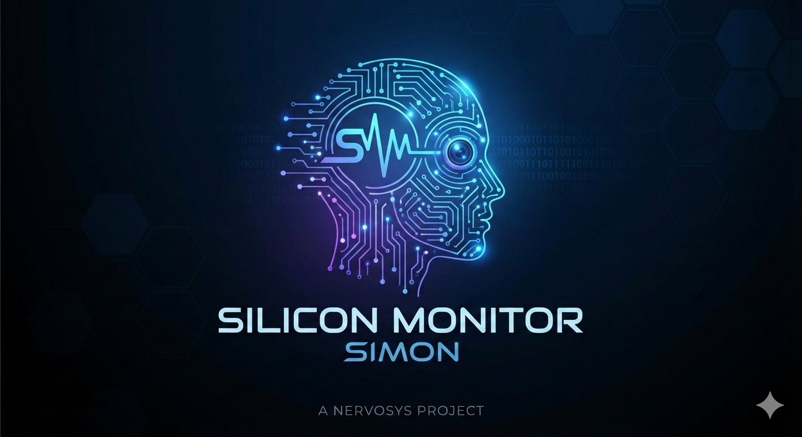

<p align="center">
  
</p>

<p align="center">
  <a href="https://crates.io/crates/silicon-monitor"></a>
  <a href="https://github.com/nervosys/SiliconMonitor/actions/workflows/build-and-push.yml"></a>
  <a href="https://github.com/nervosys/SiliconMonitor/actions"></a>
  <a href="https://github.com/nervosys/SiliconMonitor/blob/master/LICENSE"></a>
  <a href="https://github.com/nervosys/SiliconMonitor/stargazers"></a>
</p>

<p align="center">
  <strong>The world's first agentic system monitoring utility and API.</strong><br>
  <em>Built in Rust for safety and performance, featuring revolutionary hardware interfaces for AI.</em>
</p>

## Cross-platform agentic system monitoring

Silicon Monitor is a powerful, cross-platform hardware monitoring utility designed primarily for **AI agents** and **interactive interfaces**. It provides deep insights into CPUs, GPUs, memory, disks, motherboards, and network interfaces across Windows, Linux, and macOS.

[](LICENSE)
[](https://www.rust-lang.org/)


## Primary Usage Modes

| Mode | Command | Description |
|------|---------|-------------|
| 🤖 **AI Agent** | `amon` / `simon ai` | Natural language queries, MCP server for Claude, tool manifests for LLMs |
| 💻 **CLI** | `simon <component>` | Command-line monitoring with JSON output for scripting |
| 🖥️ **TUI** | `simon tui` | Interactive terminal dashboard with real-time graphs and selectable themes |
| 🪟 **GUI** | `simon gui` | Native desktop application with egui |

## Overview

Silicon Monitor provides comprehensive hardware monitoring:

- **🎮 GPU Monitoring**: NVIDIA, AMD, and Intel GPUs with utilization, memory, temperature, power, and process tracking
- **💻 CPU Monitoring**: Per-core metrics, frequencies, temperatures, and hybrid architecture support
- **🧠 Memory Monitoring**: RAM, swap, bandwidth, and latency tracking
- **💾 Disk Monitoring**: I/O operations, throughput, queue depth, and SMART data
- **🔧 Motherboard Monitoring**: System information, BIOS version, and hardware sensors
- **📊 Process Monitoring**: System-wide process tracking with GPU attribution
- **🌐 Network Monitoring**: Interface statistics, bandwidth rates, and network health
- **� Network Tools**: nmap-style port scanning, ping, traceroute, DNS lookup
- **🔊 Audio Monitoring**: Audio device enumeration, volume levels, and mute states
- **📶 Bluetooth Monitoring**: Adapter and device enumeration, battery levels, connection states
- **🖥️ Display Monitoring**: Connected displays, resolutions, refresh rates, and scaling
- **🔌 USB Monitoring**: USB device enumeration, device classes, and connection topology

**Interfaces:**

- **🤖 AI Agent**: Natural language queries, MCP server for Claude Desktop, tool manifests for all major LLMs
- **💻 CLI**: Structured command-line output with JSON support for scripting and automation
- **🖥️ TUI**: Beautiful terminal interface with real-time graphs, selectable themes, and integrated AI chat
- **🪟 GUI**: Native desktop application with multiple themes and visualizations

## Features

### Multi-Vendor GPU Support

- **NVIDIA**: Full NVML integration for all CUDA-capable GPUs (GeForce, Quadro, Tesla, Jetson)
- **AMD**: ROCm/sysfs support for RDNA/CDNA architectures (Radeon, Instinct)
- **Intel**: i915/xe driver support for Arc, Iris Xe, and Data Center GPUs
- **Unified API**: Single interface for all GPU vendors with vendor-specific capabilities

### Comprehensive Metrics

**GPU Metrics:**

- Utilization (graphics, compute, video engines)
- Memory usage (used, free, total, bandwidth)
- Clock frequencies (graphics, memory, streaming multiprocessor)
- Temperature sensors (GPU, memory, hotspot)
- Power consumption (current, average, limit, TDP)
- PCIe bandwidth and generation
- Per-process GPU memory attribution

**CPU Metrics:**

- Per-core utilization and frequency
- Temperature sensors
- Cache sizes (L1, L2, L3)
- Thread topology
- Power states

**Memory Metrics:**

- Total, used, free, available
- Swap usage
- Page faults
- Memory bandwidth

**Disk Metrics:**

- Read/write bytes and operations
- Queue depth and latency
- SMART attributes
- Device information

**Network Metrics:**

- Per-interface RX/TX statistics
- Bandwidth rates
- Packet errors and drops
- Link speed and state

### Process Monitoring with GPU Attribution

Silicon Monitor uniquely correlates system processes with GPU usage across all vendors:

```rust
use simon::{ProcessMonitor, GpuCollection};

let gpu_collection = GpuCollection::auto_detect()?;
let mut monitor = ProcessMonitor::with_gpus(gpu_collection)?;

// Get processes sorted by GPU memory usage
let gpu_procs = monitor.processes_by_gpu_memory()?;
for proc in gpu_procs.iter().take(10) {
    println!("{} (PID {}): {} MB GPU memory",
        proc.name, proc.pid, proc.total_gpu_memory_bytes / 1024 / 1024);
}
```

### AI Agent for System Analysis

Ask questions about your system in natural language:

```rust
use simon::agent::{Agent, AgentConfig, ModelSize};

let config = AgentConfig::new(ModelSize::Medium); // 500M parameters
let mut agent = Agent::new(config)?;

let response = agent.ask("What's my GPU temperature?", &monitor)?;
println!("{}", response.response);
// "GPU temperature is 65°C. ✓ Temperature is within safe range."

let response = agent.ask("How much power am I using?", &monitor)?;
// "Current GPU power consumption: 280.5W"
```

**Features**:

- Natural language queries (state, predictions, energy, recommendations)
- Multiple model sizes (100M, 500M, 1B parameters)
- Zero latency impact on monitoring (non-blocking)
- Response caching for instant repeated queries
- See [AI_AGENT.md](AI_AGENT.md) for details


### AI Agent Discoverability & Hardware Ontology

Silicon Monitor is designed from the ground up to be **discoverable by AI agents**. It provides a structured hardware ontology that allows agents to understand what monitoring capabilities are available and how to query them.

#### Hardware Ontology

The library exposes a machine-readable ontology describing hardware domains, properties, and their data types:

```rust
use simon::ai_api::HardwareOntology;

let ontology = HardwareOntology::complete();
println!("{}", serde_json::to_string_pretty(&ontology)?);
```

```json
{
  "version": "1.0.0",
  "name": "Silicon Monitor Hardware Ontology",
  "domains": [
    {
      "id": "gpu",
      "name": "Graphics Processing Unit",
      "properties": [
        { "id": "utilization", "data_type": "percentage", "unit": "%" },
        { "id": "temperature", "data_type": "temperature", "unit": "C" },
        { "id": "power_draw", "data_type": "power", "unit": "W" }
      ]
    },
    { "id": "cpu", "name": "Central Processing Unit" },
    { "id": "memory", "name": "System Memory" },
    { "id": "disk", "name": "Storage Devices" },
    { "id": "network", "name": "Network Interfaces" },
    { "id": "process", "name": "System Processes" }
  ]
}
```

#### Tool Discovery

AI agents can enumerate all available monitoring tools with their schemas:

```rust
use simon::ai_api::{AiDataApi, ToolDefinition};

let api = AiDataApi::new()?;
let tools: Vec<ToolDefinition> = api.list_tools();

for tool in &tools {
    println!("{}: {}", tool.name, tool.description);
    // get_gpu_status: Get current status of all GPUs...
    // get_cpu_usage: Get CPU utilization per-core...
}
```

#### MCP Server (Model Context Protocol)

For seamless integration with Claude Desktop and other MCP-compatible AI systems:

```bash
simon ai server   # or: amon server
```

Configure in Claude Desktop's `claude_desktop_config.json`:

```json
{
  "mcpServers": {
    "silicon-monitor": {
      "command": "simon",
      "args": ["ai", "server"]
    }
  }
}
```

#### Multi-Format Tool Export

Export tool definitions in formats optimized for different AI platforms:

```bash
amon manifest --format openai      # OpenAI function calling format
amon manifest --format anthropic   # Claude tool use format
amon manifest --format mcp         # Model Context Protocol
```

This enables AI agents to:
- **Discover** available hardware monitoring capabilities at runtime
- **Understand** the data types and units for each metric
- **Query** system state using structured tool calls
- **Reason** about hardware relationships through the ontology

## Installation

### From Source

```bash
# Clone the repository
git clone https://github.com/nervosys/SiliconMonitor
cd SiliconMonitor

# Build with all GPU vendor support
cargo build --release --features full

# Or build for specific vendors
cargo build --release --features nvidia      # NVIDIA only
cargo build --release --features amd         # AMD only
cargo build --release --features intel       # Intel only
cargo build --release --features nvidia,amd  # NVIDIA + AMD
```

### Binary Aliases

The CLI provides two binary names optimized for different use cases:

#### `simon` - Full Silicon Monitor

Complete hardware monitoring with subcommands for specific metrics:

```bash
# Launch TUI (default)
simon

# Monitor specific components
simon cpu
simon gpu
simon memory
simon processes


# Peripheral hardware
simon audio           # List audio devices and volume
simon bluetooth       # List Bluetooth adapters and devices
simon displays        # Show connected displays
simon usb             # List USB devices
simon usb             # List USB devices

# Watch mode: continuously monitor devices (press 'q' to quit)
simon cli audio --watch          # Watch audio devices
simon cli bluetooth --watch      # Watch Bluetooth devices
simon cli display --watch        # Watch connected displays
simon cli usb --watch            # Watch USB devices
simon cli usb --watch -i 2.0     # Watch USB with 2s refresh interval
simon ai query "What's my GPU temperature?"  # Ask a question
simon ai query                                 # Interactive AI mode
simon ai manifest --format openai             # Export for OpenAI/GPT
simon ai manifest --format anthropic          # Export for Claude
simon ai manifest --format gemini             # Export for Gemini
simon ai manifest --format grok               # Export for xAI Grok
simon ai manifest --format llama              # Export for Meta Llama
simon ai manifest --format mistral            # Export for Mistral
simon ai manifest --format deepseek           # Export for DeepSeek
simon ai server                               # Start MCP server for Claude Desktop

#### `amon` - AI Monitor

Dedicated AI agent interface for natural language system queries. This is syntactic sugar for `simon ai`:

```bash
# Query subcommand (default if no subcommand)
amon query "What's my GPU temperature?"   # Ask a question
amon query                                 # Interactive AI mode
amon                                       # Also starts interactive mode

# Export manifests for AI agents
amon manifest --format openai              # Export for OpenAI/GPT-4o/o1/o3
amon manifest --format anthropic           # Export for Claude 4
amon manifest --format gemini              # Export for Gemini 2.0
amon manifest --format grok                # Export for xAI Grok 3
amon manifest --format llama               # Export for Meta Llama 4
amon manifest --format mistral             # Export for Mistral Large
amon manifest --format deepseek            # Export for DeepSeek-R1/V3
amon manifest --format mcp                 # Export as MCP tools
amon manifest -o tools.json                # Save to file

# Start MCP server for Claude Desktop integration
amon server

# List available AI backends
amon --list-backends

Both binaries provide the same underlying functionality - use **`simon`** for traditional monitoring commands or **`amon`** for AI-focused interactions!

```bash
# Build both binaries
cargo build --release --features cli
```

### Feature Flags

- `nvidia` - NVIDIA GPU support via NVML
- `amd` - AMD GPU support via sysfs/DRM
- `intel` - Intel GPU support via i915/xe drivers
- `cli` - Command-line interface and TUI
- `full` - All features enabled

## Quick Start

### GPU Monitoring

```rust
use simon::gpu::GpuCollection;

fn main() -> Result<(), Box<dyn std::error::Error>> {
    // Auto-detect all GPUs (NVIDIA, AMD, Intel)
    let gpus = GpuCollection::auto_detect()?;
    
    // Get snapshot of all GPUs
    for (idx, info) in gpus.snapshot_all()?.iter().enumerate() {
        println!("GPU {}: {}", idx, info.static_info.name);
        println!("  Vendor: {:?}", info.static_info.vendor);
        println!("  Utilization: {}%", info.dynamic_info.utilization.graphics);
        println!("  Memory: {} / {} MB",
            info.dynamic_info.memory.used / 1024 / 1024,
            info.static_info.memory_total / 1024 / 1024);
        println!("  Temperature: {}°C", info.dynamic_info.temperature.gpu);
        println!("  Power: {:.1}W", info.dynamic_info.power.current / 1000.0);
    }
    
    Ok(())
}
```

### CPU Monitoring

```rust
use simon::cpu::CpuMonitor;

let mut monitor = CpuMonitor::new()?;
let info = monitor.update()?;

println!("CPU: {}", info.name);
for (idx, core) in info.cores.iter().enumerate() {
    println!("  Core {}: {:.1}% @ {} MHz",
        idx, core.utilization, core.frequency_mhz);
}
```

### Memory Monitoring

```rust
use simon::memory::MemoryMonitor;

let mut monitor = MemoryMonitor::new()?;
let info = monitor.update()?;

println!("Memory: {} / {} MB ({:.1}% used)",
    info.used_mb(), info.total_mb(), info.used_percent());
println!("Swap: {} / {} MB",
    info.swap_used_mb(), info.swap_total_mb());
```

### Network Monitoring

```rust
use simon::network_monitor::NetworkMonitor;

let mut monitor = NetworkMonitor::new()?;
let interfaces = monitor.interfaces()?;

for iface in interfaces {
    if iface.is_active() {
        let (rx_rate, tx_rate) = monitor.bandwidth_rate(&iface.name, &iface);
        println!("{}: ↓{:.2} MB/s ↑{:.2} MB/s",
            iface.name, rx_rate / 1_000_000.0, tx_rate / 1_000_000.0);
    }
}
```

### Network Diagnostic Tools (nmap, traceroute, ping style)

Silicon Monitor includes network diagnostic utilities inspired by popular CLI tools:

```rust
use simon::{ping, traceroute, scan_ports, dns_lookup, check_port};
use std::time::Duration;

// Ping a host
let result = ping("8.8.8.8", 4)?;
println!("RTT: min={:.2}ms avg={:.2}ms max={:.2}ms",
    result.rtt_min_ms, result.rtt_avg_ms, result.rtt_max_ms);

// DNS lookup
let ips = dns_lookup("google.com")?;
for ip in ips {
    println!("  → {}", ip);
}

// Traceroute
let hops = traceroute("google.com", 30)?;
for hop in &hops.hops {
    println!("{:>2}  {:>15}  {:>10}ms",
        hop.ttl,
        hop.address.as_deref().unwrap_or("*"),
        hop.rtt_ms.unwrap_or(0.0));
}

// Port scan (nmap-style TCP connect scan)
let ports = [22, 80, 443, 8080];
let results = scan_ports("192.168.1.1", &ports)?;
for r in results {
    println!("{}/tcp  {}  {}", r.port, r.status, r.service.unwrap_or_default());
}

// Quick port check (netcat-style)
let open = check_port("192.168.1.1", 80, Duration::from_secs(2))?;
println!("Port 80: {}", if open { "OPEN" } else { "CLOSED" });
```

## AI Agent CLI and API
### Peripheral Hardware Monitoring

Silicon Monitor provides cross-platform monitoring for audio, Bluetooth, display, and USB devices:

#### Audio Devices

```rust
use simon::audio::AudioMonitor;

let mut monitor = AudioMonitor::new()?;
let devices = monitor.devices();

for device in devices {
    println!("{} ({:?}): {:?}", device.name, device.device_type, device.state);
    if device.is_default {
        println!("  * Default device");
    }
    if let Some(vol) = device.volume {
        println!("  Volume: {}%", vol);
    }
}

// Get master volume (0-100)
if let Some(volume) = monitor.master_volume() {
    println!("Master volume: {}%", volume);
}
```

#### Bluetooth Devices

```rust
use simon::bluetooth::BluetoothMonitor;

let mut monitor = BluetoothMonitor::new()?;

// List adapters
for adapter in monitor.adapters() {
    println!("Adapter: {} ({})", adapter.name, adapter.address);
    println!("  Powered: {}", adapter.powered);
}

// List connected/paired devices
for device in monitor.devices() {
    println!("{} ({:?})", device.name, device.device_type);
    if let Some(battery) = device.battery_percent {
        println!("  Battery: {}%", battery);
    }
}
```

#### Display/Monitor Information

```rust
use simon::display::DisplayMonitor;

let monitor = DisplayMonitor::new()?;

for display in monitor.displays() {
    println!("Display {}: {}x{} @ {}Hz",
        display.id, display.width, display.height, display.refresh_rate);
    if display.is_primary {
        println!("  * Primary display");
    }
    println!("  Aspect ratio: {}", display.aspect_ratio());
    if let Some(scale) = display.scale_factor {
        println!("  Scale: {}x", scale);
    }
}
```

#### USB Devices

```rust
use simon::usb::UsbMonitor;

let monitor = UsbMonitor::new()?;

for device in monitor.devices() {
    println!("USB {:04x}:{:04x} - {} {}",
        device.vendor_id, device.product_id,
        device.manufacturer.as_deref().unwrap_or("Unknown"),
        device.product.as_deref().unwrap_or("Unknown"));
    println!("  Class: {:?}", device.device_class);
    println!("  Bus {}, Port {}", device.bus_number, device.port_number);
}
```


Silicon Monitor includes a lightweight AI agent that can answer questions about your system in natural language:

### Command Line Interface

```bash
# Quick single queries with amon
amon query "What's my GPU temperature?"
amon query "Show CPU usage"
amon query "Is my memory usage normal?"


# Interactive AI session
amon
# You: What's my GPU doing?
# 🤖 Agent: Your GPU is currently at 45% utilization...

# Or use simon ai subcommand
simon ai query "Analyze my system performance"
simon ai  # Interactive mode
```

### Programmatic Usage

```rust
use simon::agent::{Agent, AgentConfig, ModelSize};
use simon::SiliconMonitor;

let monitor = SiliconMonitor::new()?;
let config = AgentConfig::new(ModelSize::Medium);
let mut agent = Agent::new(config)?;

let response = agent.ask("What's my GPU temperature?", &monitor)?;
println!("{}", response.response);
```

### Agent Features

- **Natural Language**: Ask questions in plain English
- **System Aware**: Accesses real-time hardware metrics
- **Multiple Backends**: Automatic detection of local and remote AI models
- **Privacy First**: Rule-based fallback when no backends configured
- **Smart Caching**: Remembers recent queries for instant responses
- **Interactive Mode**: Multi-turn conversations about your system

### Supported Backends

The AI agent automatically detects and uses available backends in this order:

**Local Inference Backends** (✅ Implemented):

- **TensorRT-LLM** - NVIDIA optimized inference (requires Triton server)
- **vLLM** - High-performance serving with PagedAttention
- **Ollama** - Easy local model management (recommended for beginners)
- **LM Studio** - User-friendly GUI for local models
- **llama.cpp** - Direct GGUF model loading (placeholder, needs bindings)

**Remote API Backends**:

- **OpenAI API** - GPT models (requires `OPENAI_API_KEY`)
- **Anthropic Claude** - Claude models (requires `ANTHROPIC_API_KEY`)
- **GitHub Models** - Free AI models (requires `GITHUB_TOKEN`)
- **Azure OpenAI** - Enterprise OpenAI (requires `AZURE_OPENAI_API_KEY`)

**Always Available**:

- **Rule-Based** - Built-in fallback system (no setup required)

See [LOCAL_AI_BACKENDS.md](LOCAL_AI_BACKENDS.md) for detailed setup instructions.

### Backend Configuration

```bash
# List available backends
amon --list-backends
# [*] Available AI Backends:
# 1. Rule-Based (Built-in)
# 2. Ollama (Local Server) [+] running
# 3. GitHub Models
#    API Key: GITHUB_TOKEN [+] configured
#    Endpoint: https://models.inference.ai.azure.com

# Automatic backend detection (default)
amon query "What's my GPU temperature?"
# [*] Using backend: Ollama
# Question: What's my GPU temperature?
# ...

# Configure via environment variables (remote APIs only)
export OPENAI_API_KEY="sk-..."      # For OpenAI
export ANTHROPIC_API_KEY="sk-..."  # For Anthropic
export GITHUB_TOKEN="ghp_..."       # For GitHub Models

# Or start local inference servers
ollama serve                         # Ollama (easiest)
vllm serve meta-llama/Llama-3-8B    # vLLM (fastest)
# TensorRT-LLM via Triton             # TensorRT (NVIDIA only)
ollama serve                         # Ollama on port 11434
# LM Studio GUI → Start Server      # LM Studio on port 1234
```

### Programmatic Backend Selection

```rust
use simon::agent::{AgentConfig, BackendConfig, BackendType};

// Auto-detect best backend
let config = AgentConfig::auto_detect()?;

// Or use specific backend
let config = AgentConfig::with_backend_type(BackendType::RemoteOpenAI)?;

// Or custom configuration
let backend = BackendConfig::openai("gpt-4o-mini", Some("sk-...".into()));
let config = AgentConfig::with_backend(backend);

let mut agent = Agent::new(config)?;
```

**Example Queries:**

- "What's my GPU temperature and is it safe?"
- "Show me CPU usage across all cores"
- "How much memory am I using?"
- "Is my system running hot?"
- "What processes are using the most GPU memory?"

## Terminal User Interface (TUI)

Silicon Monitor includes a beautiful TUI for real-time monitoring with integrated AI agent:

```bash
# Build and run the TUI
cargo run --release --features cli --example tui

# Or after installation (using either binary name)
simon
amon    # AI Monitor alias
```

**TUI Features:**

- 📊 Real-time graphs with 60-second history
- 🎨 **Selectable color themes** - Press `t` to choose from 6 themes (Catppuccin Mocha/Latte, Glances, Nord, Dracula, Gruvbox Dark)
- ⌨️ Keyboard navigation (←/→ or 1-6 for tabs, Q to quit)
- 📈 Sparkline charts for trends
- 🔍 **Process selection** - Use ↑/↓ arrows to navigate processes, Enter for detailed view
- 🤖 **Integrated AI Agent** - Press `a` to ask questions about your system
- 🖥️ 6 tabs: Overview, CPU, GPU, Memory, System, **Agent**

**Keyboard Shortcuts:**

| Key | Action |
|-----|--------|
| `q` | Quit |
| `Tab` | Cycle process sort mode |
| `↑/↓` | Select process |
| `Enter` | Open process detail view |
| `Esc` | Close overlay/detail view |
| `t` / `T` | Open theme picker |
| `PgUp/PgDn` | Page through processes |
| `Home/End` | Jump to first/last process |
| `r` | Reset scroll position |

**Agent Tab:**

- Natural language queries: "What's my GPU temperature?"
- Conversation history with timing
- Response caching for instant repeated queries
- Zero impact on monitoring performance

See [TUI_AGENT_GUIDE.md](TUI_AGENT_GUIDE.md) for complete agent usage guide.

<details>
<summary><strong>📸 TUI Screenshots</strong> (click to expand)</summary>

|                 Overview Tab                  |                GPU Tab                |                Agent Tab                |
| :-------------------------------------------: | :-----------------------------------: | :-------------------------------------: |
|  |    |  |
|     Real-time system overview with gauges     | GPU metrics, temperature, utilization |       Natural language AI queries       |

</details>

## Graphical User Interface (GUI)

Silicon Monitor also includes a native desktop GUI built with egui for a modern graphical experience:

```bash
# Build and run the GUI
cargo run --release --features gui

# Or after installation
simon gui
```

**GUI Features:**

- 🖼️ Native desktop application (Windows, Linux, macOS)
- 🎨 Multiple color themes (Dark, Light, Ocean, Forest, Sunset, Monochrome)
- 📊 Real-time graphs and visualizations
- 🔄 Auto-refreshing metrics
- 🖱️ Mouse-friendly interface with scrollable panels
- 📈 Historical data with trend charts

<details>
<summary><strong>📸 GUI Screenshots</strong> (click to expand)</summary>

|                System Overview                |           GPU Monitoring            |              Theme Selection              |
| :-------------------------------------------: | :---------------------------------: | :---------------------------------------: |
|  |  |  |
|       Main dashboard with system stats        |     Detailed GPU metrics panel      |          Available color themes           |

</details>

## Examples

The repository includes comprehensive examples:

- **`gpu_monitor.rs`** - Multi-vendor GPU monitoring with all metrics
- **`nvidia_monitor.rs`** - NVIDIA-specific features (NVML)
- **`amd_monitor.rs`** - AMD-specific features (sysfs/DRM)
- **`intel_monitor.rs`** - Intel-specific features (i915/xe)
- **`all_gpus.rs`** - Unified multi-vendor GPU example
- **`cpu_monitor.rs`** - CPU metrics and per-core stats
- **`memory_monitor.rs`** - Memory and swap usage
- **`disk_monitor.rs`** - Disk I/O and SMART data
- **`motherboard_monitor.rs`** - System information and sensors
- **`process_monitor.rs`** - Process listing with GPU attribution
- **`network_monitor.rs`** - Network interface statistics
- **`tui.rs`** - Interactive terminal UI
- **``audio_monitor.rs``** - Audio device enumeration and volume
- **``bluetooth_monitor.rs``** - Bluetooth adapter and device discovery
- **``display_monitor.rs``** - Display/monitor information
- **``usb_monitor.rs``** - USB device enumeration
- **`agent_simple.rs`** - AI agent quick demo
- **`agent_demo.rs`** - AI agent interactive demo with model selection

Run any example with:

```bash
cargo run --release --features nvidia --example gpu_monitor
cargo run --release --features nvidia --example process_monitor
cargo run --release --example network_monitor
cargo run --release --features cli --example tui
cargo run --release --features cli --example audio_monitor
cargo run --release --features cli --example bluetooth_monitor
cargo run --release --features cli --example display_monitor
cargo run --release --features cli --example usb_monitor
cargo run --release --features full --example agent_simple
```

## Platform Support

| Platform | CPU | Memory | Disk | GPU (NVIDIA) | GPU (AMD) | GPU (Intel) | Network | Audio | Bluetooth | Display | USB |
| -------- | --- | ------ | ---- | ------------ | --------- | ----------- | ------- | ----- | --------- | ------- | --- |
| Linux    | ✅   | ✅      | ✅    | ✅            | ✅         | ✅           | ✅       | ✅     | ✅         | ✅       | ✅   |
| Windows  | ✅   | ✅      | ✅    | ✅            | 🚧         | 🚧           | ✅       | ✅     | ✅         | ✅       | ✅   |
| macOS    | ✅   | ✅      | ✅    | ❌            | ❌         | ❌           | ✅       | ✅     | ✅         | ✅       | ✅   |

✅ Fully Supported | 🚧 Partial/In Progress | ❌ Not Supported

### GPU Backend Details

**NVIDIA:**

- **Linux**: Full NVML support via `libnvidia-ml.so`
- **Windows**: Full NVML support via `nvml.dll`
- **Metrics**: All metrics supported - utilization, memory, clocks, power, temperature, processes, throttling, ECC
- **Devices**: GeForce, Quadro, Tesla, Jetson (Nano, TX1/TX2, Xavier, Orin, Thor)

**AMD:**

- **Linux**: sysfs via `/sys/class/drm/card*/device/`
- **Metrics**: Utilization (GFX/compute), VRAM, clocks (SCLK/MCLK), temperature, power, fan speed
- **Devices**: RDNA 1/2/3, CDNA 1/2 (Radeon RX 5000+, Instinct MI series)
- **Requirements**: amdgpu driver

**Intel:**

- **Linux**: i915/xe drivers via `/sys/class/drm/card*/`
- **Metrics**: GT frequency, memory (discrete GPUs), temperature, power via hwmon
- **Devices**: Arc A-series, Iris Xe, UHD Graphics, Data Center GPU Max
- **Requirements**: i915 (legacy) or xe (modern) kernel driver

## Architecture

```plaintext
simon/
├── cpu/                   CPU monitoring (per-core, frequency, temperature)
├── memory/                Memory and swap monitoring
├── disk/                  Disk I/O and SMART monitoring
├── motherboard/           System info, BIOS, sensors
├── gpu/                   Multi-vendor GPU abstraction
│   ├── mod.rs               Unified Device trait, GpuCollection
│   ├── nvidia_new.rs        NVIDIA backend (NVML)
│   ├── amd_rocm.rs          AMD backend (sysfs/DRM)
│   └── intel_levelzero.rs   Intel backend (i915/xe)
├── process_monitor.rs     Process enumeration with GPU attribution
├── network_monitor.rs     Network interface statistics
├── tui/                   Terminal user interface
│   ├── app.rs               Application state and logic
│   └── ui.rs                Rendering with ratatui
└── platform/              Platform-specific implementations
```

## API Documentation

### GPU Collection API

The `GpuCollection` provides a unified interface for all GPU vendors:

```rust
use simon::gpu::{GpuCollection, Device};

// Auto-detect all available GPUs
let collection = GpuCollection::auto_detect()?;

// Get count of detected GPUs
println!("Found {} GPUs", collection.device_count());

// Snapshot all GPUs at once
let snapshots = collection.snapshot_all()?;

// Access individual devices
for device in collection.gpus() {
    println!("{} ({})", device.name()?, device.vendor());
}
```

### Process Monitoring

The `ProcessMonitor` correlates system processes with GPU usage:

```rust
use simon::process_monitor::ProcessMonitor;
use simon::gpu::GpuCollection;

let gpus = GpuCollection::auto_detect()?;
let mut monitor = ProcessMonitor::with_gpus(gpus)?;

// Get all processes
let processes = monitor.processes()?;

// Get top GPU consumers
let gpu_procs = monitor.processes_by_gpu_memory()?;

// Get top CPU consumers
let cpu_procs = monitor.processes_by_cpu()?;

// Get only GPU processes
let gpu_only = monitor.gpu_processes()?;
```

### Network Monitor API

The `NetworkMonitor` tracks network interface statistics:

```rust
use simon::network_monitor::NetworkMonitor;

let mut monitor = NetworkMonitor::new()?;

// Get all interfaces
let interfaces = monitor.interfaces()?;

// Get only active interfaces
let active = monitor.active_interfaces()?;

// Get specific interface
if let Some(iface) = monitor.interface_by_name("eth0")? {
    println!("RX: {} MB", iface.rx_mb());
    println!("TX: {} MB", iface.tx_mb());
    
    // Calculate bandwidth rate
    let (rx_rate, tx_rate) = monitor.bandwidth_rate("eth0", &iface);
    println!("Rate: ↓{:.2} MB/s ↑{:.2} MB/s",
        rx_rate / 1_000_000.0, tx_rate / 1_000_000.0);
}
```

Full API documentation:

```bash
cargo doc --features full --no-deps --open
```

## Building from Source

### Prerequisites

**Linux:**

```bash
# Ubuntu/Debian
sudo apt install build-essential pkg-config libdrm-dev

# Fedora
sudo dnf install @development-tools libdrm-devel

# Arch
sudo pacman -S base-devel libdrm

# For NVIDIA support, install CUDA toolkit or driver (provides libnvidia-ml.so)
```

**Windows:**

```bash
# Install Visual Studio Build Tools (2019 or later)
# For NVIDIA support, install CUDA toolkit or NVIDIA driver (provides nvml.dll)
```

**macOS:**

```bash
# Install Xcode command line tools
xcode-select --install
```

### Compilation

```bash
# Clone the repository
git clone https://github.com/nervosys/SiliconMonitor
cd SiliconMonitor

# Development build
cargo build --features full

# Release build (optimized)
cargo build --release --features full

# Run tests
cargo test --features full

# Run specific example
cargo run --release --features nvidia --example gpu_monitor
```

## Contributing

Contributions are welcome! Areas that need help:

- **Windows Support**: Process monitoring, network monitoring
- **macOS Support**: Process monitoring, network monitoring, Apple GPU integration
- **AMD GPU**: Windows support via AMD Display Library (ADL)
- **Intel GPU**: Windows support via Intel GPU monitoring APIs
- **Documentation**: More examples, tutorials, API documentation
- **Testing**: Multi-GPU setups, edge cases, platform-specific bugs

See [CONTRIBUTING.md](CONTRIBUTING.md) for guidelines.

### Development Workflow

```bash
# Format code
cargo fmt

# Run clippy
cargo clippy --features full -- -D warnings

# Run tests
cargo test --features full

# Build documentation
cargo doc --features full --no-deps --open

# Run examples
cargo run --release --features nvidia --example gpu_monitor
```

## License

This project is licensed under either of:

- Apache License, Version 2.0 ([LICENSE-APACHE](LICENSE) or <http://www.apache.org/licenses/LICENSE-2.0>)
- MIT License ([LICENSE-MIT](LICENSE-MIT) or <http://opensource.org/licenses/MIT>)

at your option.

## Acknowledgments

Silicon Monitor builds upon and is inspired by:

- **[jetson-stats](https://github.com/rbonghi/jetson_stats)** by Raffaello Bonghi - Comprehensive monitoring for NVIDIA Jetson devices
- **[nvtop](https://github.com/Syllo/nvtop)** - GPU monitoring TUI for Linux
- **[radeontop](https://github.com/clbr/radeontop)** - AMD GPU monitoring
- **[intel_gpu_top](https://gitlab.freedesktop.org/drm/igt-gpu-tools)** - Intel GPU monitoring

Special thanks to the Rust community and the maintainers of the following crates:

- [ratatui](https://github.com/ratatui-org/ratatui) - Terminal UI framework
- [sysinfo](https://github.com/GuillaumeGomez/sysinfo) - System information
- [nvml-wrapper](https://github.com/Cldfire/nvml-wrapper) - NVIDIA NVML bindings

## Support

- **Issues**: [GitHub Issues](https://github.com/nervosys/SiliconMonitor/issues)
- **Discussions**: [GitHub Discussions](https://github.com/nervosys/SiliconMonitor/discussions)
- **Documentation**: [docs.rs/simon](https://docs.rs/simon)

---

Made with 🦾 by NERVOSYS
