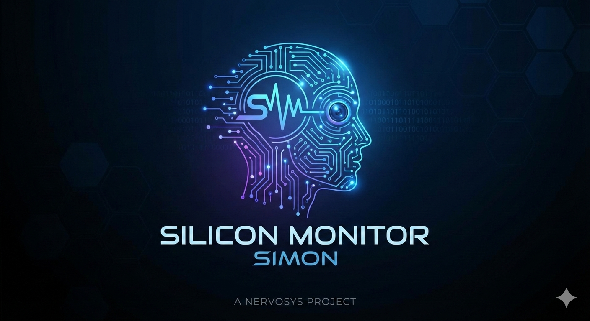

<p align="center">
  
</p>

<p align="center">
  <a href="https://crates.io/crates/silicon-monitor"></a>
  <a href="https://github.com/nervosys/SiliconMonitor/actions/workflows/build-and-push.yml"></a>
  <a href="https://github.com/nervosys/SiliconMonitor/actions"></a>
  <a href="https://github.com/nervosys/SiliconMonitor/blob/master/LICENSE"></a>
  <a href="https://github.com/nervosys/SiliconMonitor/stargazers"></a>
</p>

<p align="center">
  <strong>The world's first agentic system monitoring utility and API.</strong><br>
  <em>Built in Rust for safety and performance, featuring revolutionary hardware interfaces for AI.</em>
</p>

## Cross-platform agentic system monitoring

Silicon Monitor is a powerful, cross-platform hardware monitoring utility designed primarily for **AI agents** and **interactive interfaces**. It provides deep insights into CPUs, GPUs, memory, disks, motherboards, and network interfaces across Windows, Linux, and macOS.

[](https://www.rust-lang.org/)


## Primary Usage Modes

| Mode           | Command             | Description                                                                |
| -------------- | ------------------- | -------------------------------------------------------------------------- |
| 🤖 **AI Agent** | `amon` / `simon ai` | Natural language queries, MCP server for Claude, tool manifests for LLMs   |
| 💻 **CLI**      | `simon <component>` | Command-line monitoring with JSON output for scripting                     |
| 🖥️ **TUI**      | `simon tui`         | Interactive terminal dashboard with real-time graphs and selectable themes |
| 🪟 **GUI**      | `simon gui`         | Native desktop application with egui                                       |

## Overview

Silicon Monitor provides comprehensive hardware monitoring:

- **🛠 Hardware Profile Inspector**: NVIDIA Profile Inspector / Intel XTU / AMD Ryzen Master / nvme-cli equivalents — read & (selectively) write driver profiles, per-app NVIDIA DRS data, CPU power limits, NVMe Get-Features, EDID/XMP/EXPO, with audit-logged apply layer. See [`simon profile --help`](#hardware-profile-inspector).
- **🎮 GPU Monitoring**: NVIDIA, AMD, and Intel GPUs with utilization, memory, temperature, power, and process tracking
- **💻 CPU Monitoring**: Per-core metrics, frequencies, temperatures, and hybrid architecture support
- **🧠 Memory Monitoring**: RAM, swap, bandwidth, and latency tracking
- **💾 Disk Monitoring**: I/O operations, throughput, queue depth, SMART attributes, and NVMe controller data, with health derived from what the drive actually reports
- **🔧 Motherboard Monitoring**: System information, BIOS version, and hardware sensors
- **📊 Process Monitoring**: System-wide process tracking with GPU attribution
- **🌐 Network Monitoring**: Interface statistics, bandwidth rates, and network health
- **� Network Tools**: nmap-style port scanning, ping, traceroute, DNS lookup
- **🔊 Audio Monitoring**: Audio device enumeration, volume levels, and mute states
- **📶 Bluetooth Monitoring**: Adapter and device enumeration, battery levels, connection states
- **🖥️ Display Monitoring**: Connected displays, resolutions, refresh rates, and scaling
- **🔌 USB Monitoring**: USB device enumeration, device classes, and connection topology

**Interfaces:**

- **🤖 AI Agent**: Natural language queries, MCP server for Claude Desktop, tool manifests for all major LLMs
- **💻 CLI**: Structured command-line output with JSON support for scripting and automation
- **🖥️ TUI**: Beautiful terminal interface with real-time graphs, selectable themes, and integrated AI chat
- **🪟 GUI**: Native desktop application with multiple themes and visualizations

## Features

### Multi-Vendor GPU Support

- **NVIDIA**: Full NVML integration for all CUDA-capable GPUs (GeForce, Quadro, Tesla, Jetson)
- **AMD**: ROCm/sysfs support for RDNA/CDNA architectures (Radeon, Instinct)
- **Intel**: i915/xe driver support for Arc, Iris Xe, and Data Center GPUs
- **Unified API**: Single interface for all GPU vendors with vendor-specific capabilities

### Comprehensive Metrics

**GPU Metrics:**

- Utilization (graphics, compute, video engines)
- Memory usage (used, free, total, bandwidth)
- Clock frequencies (graphics, memory, streaming multiprocessor)
- Temperature sensors (GPU, memory, hotspot)
- Power consumption (current, average, limit, TDP)
- PCIe bandwidth and generation
- Per-process GPU memory attribution

**CPU Metrics:**

- Per-core utilization and frequency
- Temperature sensors
- Cache sizes (L1, L2, L3)
- Thread topology
- Power states

**Memory Metrics:**

- Total, used, free, available
- Swap usage
- Page faults
- Memory bandwidth

**Disk Metrics:**

- Read/write bytes and operations
- Queue depth and latency
- SMART attributes
- Device information

**Network Metrics:**

- Per-interface RX/TX statistics
- Bandwidth rates
- Packet errors and drops
- Link speed and state

### Process Monitoring with GPU Attribution

Silicon Monitor uniquely correlates system processes with GPU usage across all vendors:

```rust
use simonlib::{ProcessMonitor, GpuCollection};

let gpu_collection = GpuCollection::auto_detect()?;
let mut monitor = ProcessMonitor::with_gpus(gpu_collection)?;

// Get processes sorted by GPU memory usage
let gpu_procs = monitor.processes_by_gpu_memory()?;
for proc in gpu_procs.iter().take(10) {
    println!("{} (PID {}): {} MB GPU memory",
        proc.name, proc.pid, proc.total_gpu_memory_bytes / 1024 / 1024);
}
```

### AI Agent for System Analysis

Ask questions about your system in natural language:

```rust
use simonlib::agent::{Agent, AgentConfig, ModelSize};

let config = AgentConfig::new(ModelSize::Medium); // 500M parameters
let mut agent = Agent::new(config)?;

let response = agent.ask("What's my GPU temperature?", &monitor)?;
println!("{}", response.response);
// "GPU temperature is 65°C. ✓ Temperature is within safe range."

let response = agent.ask("How much power am I using?", &monitor)?;
// "Current GPU power consumption: 280.5W"
```

**Features**:

- Natural language queries (state, predictions, energy, recommendations)
- Multiple model sizes (100M, 500M, 1B parameters)
- Zero latency impact on monitoring (non-blocking)
- Response caching for instant repeated queries
- See [docs/AI_AGENT.md](docs/AI_AGENT.md) for the agent itself, [AI_INTEGRATION.md](AI_INTEGRATION.md) for model providers, and [AGENTS.md](AGENTS.md) for driving simon programmatically


### Use-case tuning

`simon tune` works out what the machine is being used for — AI training, AI
inference, gaming, interactive, idle — and recommends the hardware profile
settings that suit it. `--watch N` turns it into the automatic server.

```bash
simon tune                      # classify and recommend; writes nothing
simon tune --watch 60           # the server: re-evaluate every minute
simon tune --as gaming          # plan for a use case without waiting for it
simon tune -f json              # the machine-facing form
```

```
Use case: ai_training  (confidence 90%, from signals)
  · busiest GPU at 97% utilisation; CPU at 22%; AI workload detected (pytorch) doing training
  · an AI framework was identified in a running process

Recommended (1):
  Active Power Scheme [Safe]
    381b4222-... -> 8c5e7fda-...
    basis: the driver's own choice "High performance" for this setting
    why:   AI work is bursty on the CPU while the GPU waits on it; core parking
           adds latency to every dispatch
```

**Two properties worth knowing before trusting it.**

It recommends and writes nothing by default. Applying needs `--apply` *and*
`--confirm`, goes through the audited apply layer, and is capped below the risk
tier that covers power, thermal and voltage writes — `--max-risk dangerous` is
rejected, not clamped.

Every proposed value comes from what the driver itself declared, never from a
model. A language model may classify the workload, where being wrong costs a
suboptimal profile; it does not choose values, because a number with no
provenance cannot be checked against anything the hardware said. `basis` on each
recommendation records where the value came from, and a setting whose provider
enumerates no choices is skipped with a reason rather than given a
plausible-looking one.

### AI Agent Discoverability & Hardware Ontology

Silicon Monitor is designed from the ground up to be **discoverable by AI agents**. It provides a structured hardware ontology that allows agents to understand what monitoring capabilities are available and how to query them.

#### Hardware Ontology

Every value simon can report has a stable dotted id, a unit, and — the part that
matters — a **provenance** saying whether it was measured, taken from a
specification, derived, or is unavailable here. No model or library linkage is
needed; it is a command:

```bash
simon describe --format json          # the schema: ids, units, provenance
simon get gpu.0.thermal.temperature   # read one value
simon snapshot --validate             # read everything, range-checked
```

```json
{
  "id": "gpu.0.power.limit",
  "value": 450000,
  "provenance": "measured",
  "unit": "milliwatts"
}
```

A value that could not be read carries no `value` at all, and always says why —
so an agent can tell an absent device from an unimplemented reader, and never
mistakes a plausible constant for a live reading:

```json
{
  "id": "gpu.2.clocks.graphics",
  "provenance": "unavailable",
  "note": "driver reports no graphics clock"
}
```

Coverage is deliberately reported rather than claimed. `simon describe` prints
the entity count, and the ontology currently names **134 entities across 12
domains** — cpu (including cache topology), gpu, memory (including per-slot DIMM
topology, NUMA layout and ECC error counts), disk (including SMART, health and NVMe endurance), network, power,
thermal, process, system (including virtualization posture), board (including firmware inventory and TPM state), pci
(including negotiated versus maximum PCIe link width and speed) and usb. On one
desktop those expand to 780 resolved readings and 432 that are
unavailable-with-a-reason.

Some of those readings are worth having precisely because nothing else reports
them. `pci.{addr}.link.width` against `pci.{addr}.link.max_width` on the
development machine shows a card negotiated at **x8 in a x16-capable slot** —
half its bandwidth, and not an error anywhere in the system.

It does not yet name everything the library can read. simon has around 88
subsystem modules, and the ones without ontology entities — NUMA topology, RAPL,
sensors, virtualization, EDAC, and others — are reachable through the library and
the `cli` subcommands but not yet through `describe`, `get` and `snapshot`. That
gap is being closed in phases, and a phase ships only when its resolver can state
a true provenance for every field. An id that resolves to a confident guess is
worse for an agent than one that does not exist.

#### The ontology tests the ontology

`tests/ontology_conformance.rs` names nothing it checks. It asks the ontology
what exists, resolves it, and asserts the rules the ontology documents about
itself — every declared entity reachable, every reading traceable to the schema,
every absence carrying a reason, no `nullable: false` entity resolving to null,
every value's JSON type matching its unit, nothing outside its declared range,
and no enum's `Unknown` dressed up as a measurement.

A domain added later is covered by all of it on the commit that adds it, with no
edit to the file — which matters because the failure mode of a hand-written suite
is that the newest reader is the least tested one. It found three defects on its
first run, including an entity that had been declared since the ontology was
written and that no resolver had ever filled.

```bash
cargo test --test ontology_conformance -- --nocapture   # includes a coverage table
```

See **[AGENTS.md](AGENTS.md)** for the full contract: exit codes, the write
surface, and how to read the TUI and GUI without a terminal or display.

> The older `simonlib::ai_api::HardwareOntology` is superseded. It carries no
> provenance, cannot resolve an id to a value, and no command exposes it.

<details>
<summary>Legacy library-only ontology (superseded)</summary>

```rust
use simonlib::ai_api::HardwareOntology;

let ontology = HardwareOntology::complete();
println!("{}", serde_json::to_string_pretty(&ontology)?);
```

```json
{
  "version": "1.0.0",
  "name": "Silicon Monitor Hardware Ontology",
  "domains": [
    {
      "id": "gpu",
      "name": "Graphics Processing Unit",
      "properties": [
        { "id": "utilization", "data_type": "percentage", "unit": "%" },
        { "id": "temperature", "data_type": "temperature", "unit": "C" },
        { "id": "power_draw", "data_type": "power", "unit": "W" }
      ]
    },
    { "id": "cpu", "name": "Central Processing Unit" },
    { "id": "memory", "name": "System Memory" },
    { "id": "disk", "name": "Storage Devices" },
    { "id": "network", "name": "Network Interfaces" },
    { "id": "process", "name": "System Processes" }
  ]
}
```

</details>

#### Tool Discovery

AI agents can enumerate all available monitoring tools with their schemas:

```rust
use simonlib::ai_api::{AiDataApi, ToolDefinition};

let api = AiDataApi::new()?;
let tools: Vec<ToolDefinition> = api.list_tools();

for tool in &tools {
    println!("{}: {}", tool.name, tool.description);
    // get_gpu_status: Get current status of all GPUs...
    // get_cpu_usage: Get CPU utilization per-core...
}
```

#### MCP Server (Model Context Protocol)

For seamless integration with Claude Desktop and other MCP-compatible AI systems:

```bash
simon ai server   # or: amon server
```

Configure in Claude Desktop's `claude_desktop_config.json`:

```json
{
  "mcpServers": {
    "silicon-monitor": {
      "command": "simon",
      "args": ["ai", "server"]
    }
  }
}
```

#### Multi-Format Tool Export

Export tool definitions in formats optimized for different AI platforms:

```bash
amon manifest --format openai      # OpenAI function calling format
amon manifest --format anthropic   # Claude tool use format
amon manifest --format mcp         # Model Context Protocol
```

This enables AI agents to:

- **Discover** available hardware monitoring capabilities at runtime
- **Understand** the data types and units for each metric
- **Query** system state using structured tool calls
- **Reason** about hardware relationships through the ontology

## Installation

### From crates.io

```bash
cargo install silicon-monitor
```

That installs both binaries, `simon` and `amon`. Default features are `full`,
which includes the GUI, so on Linux the build needs system development packages:

```bash
sudo apt-get install -y libxkbcommon-dev libwayland-dev libxcursor-dev \
  libxrandr-dev libxi-dev libgl1-mesa-dev libssl-dev
```

As a library, where the GUI and CLI stacks are usually unwanted:

```toml
[dependencies]
silicon-monitor = { version = "3.0", default-features = false, features = ["cpu", "io", "network"] }
```

The crate is published as `silicon-monitor` and imported as `simonlib`:

```rust
use simonlib::disk;
```

### From Source

```bash
# Clone the repository
git clone https://github.com/nervosys/SiliconMonitor
cd SiliconMonitor

# Build with all GPU vendor support
cargo build --release --features full

# Or build for specific vendors
cargo build --release --features nvidia      # NVIDIA only
cargo build --release --features amd         # AMD only
cargo build --release --features intel       # Intel only
cargo build --release --features nvidia,amd  # NVIDIA + AMD
```

### Binary Aliases

The CLI provides two binary names optimized for different use cases:

#### `simon` - Full Silicon Monitor

Complete hardware monitoring with subcommands for specific metrics:

```bash
# No subcommand: launches the GUI, or the TUI if built without the `gui` feature
simon

# Launch the TUI explicitly
simon tui

# Monitor specific components
simon cli cpu
simon cli gpu
simon cli memory
simon cli processes


# Peripheral hardware
simon cli audio       # List audio devices and volume
simon cli bluetooth   # List Bluetooth adapters and devices
simon cli display     # Show connected displays
simon cli usb         # List USB devices

# Watch mode: continuously monitor devices (press 'q' to quit)
simon cli audio --watch          # Watch audio devices
simon cli bluetooth --watch      # Watch Bluetooth devices
simon cli display --watch        # Watch connected displays
simon cli usb --watch            # Watch USB devices
simon cli usb --watch -i 2.0     # Watch USB with 2s refresh interval
simon ai query "What's my GPU temperature?"  # Ask a question
simon ai query                                 # Interactive AI mode
simon ai manifest --format openai             # Export for OpenAI/GPT
simon ai manifest --format anthropic          # Export for Claude
simon ai manifest --format gemini             # Export for Gemini
simon ai manifest --format grok               # Export for xAI Grok
simon ai manifest --format llama              # Export for Meta Llama
simon ai manifest --format mistral            # Export for Mistral
simon ai manifest --format deepseek           # Export for DeepSeek
simon ai server                               # Start MCP server for Claude Desktop

#### `amon` - AI Monitor

Dedicated AI agent interface for natural language system queries. This is syntactic sugar for `simon ai`:

```bash
# Query subcommand (default if no subcommand)
amon query "What's my GPU temperature?"   # Ask a question
amon query                                 # Interactive AI mode
amon                                       # Also starts interactive mode

# Export manifests for AI agents
amon manifest --format openai              # Export for OpenAI models
amon manifest --format anthropic           # Export for Claude 4
amon manifest --format gemini              # Export for Gemini 2.0
amon manifest --format grok                # Export for xAI Grok 3
amon manifest --format llama               # Export for Meta Llama 4
amon manifest --format mistral             # Export for Mistral Large
amon manifest --format deepseek            # Export for DeepSeek-R1/V3
amon manifest --format mcp                 # Export as MCP tools
amon manifest -o tools.json                # Save to file

# Start MCP server for Claude Desktop integration
amon server

# List available AI backends
amon --list-backends

Both binaries provide the same underlying functionality - use **`simon`** for traditional monitoring commands or **`amon`** for AI-focused interactions!

```bash
# Build both binaries
cargo build --release --features cli
```

### Feature Flags

- `nvidia` - NVIDIA GPU support via NVML
- `amd` - AMD GPU support via sysfs/DRM
- `intel` - Intel GPU support via i915/xe drivers
- `apple` - Apple Silicon support (M-series) via `powermetrics`
- `cpu` - Enhanced CPU monitoring (per-core, clusters, power states)
- `npu` - NPU/ASIC monitoring (ANE, Intel NPU, AMD AI Engine)
- `io` - I/O controller monitoring (PCIe, NVMe, USB, Thunderbolt)
- `network` - Network silicon monitoring (WiFi, Ethernet, offload engines)
- `cli` - Command-line interface and TUI
- `gui` - Desktop GUI
- `full` - All features enabled (the default)

Every feature builds in isolation, and CI checks each one that way on every push —
`--all-features` cannot catch a feature that only compiles because another supplies
what it is missing. Built without `gui`, `simon` with no subcommand launches the
TUI instead of the desktop window.

## Quick Start

### GPU Monitoring

```rust
use simonlib::gpu::GpuCollection;

fn main() -> Result<(), Box<dyn std::error::Error>> {
    // Auto-detect all GPUs (NVIDIA, AMD, Intel)
    let gpus = GpuCollection::auto_detect()?;
    
    // Get snapshot of all GPUs
    for (idx, info) in gpus.snapshot_all()?.iter().enumerate() {
        println!("GPU {}: {}", idx, info.static_info.name);
        println!("  Vendor: {:?}", info.static_info.vendor);
        println!("  Utilization: {}%", info.dynamic_info.utilization.graphics);
        println!("  Memory: {} / {} MB",
            info.dynamic_info.memory.used / 1024 / 1024,
            info.static_info.memory_total / 1024 / 1024);
        println!("  Temperature: {}°C", info.dynamic_info.temperature.gpu);
        println!("  Power: {:.1}W", info.dynamic_info.power.current / 1000.0);
    }
    
    Ok(())
}
```

### CPU Monitoring

```rust
use simonlib::cpu::CpuMonitor;

let mut monitor = CpuMonitor::new()?;
let info = monitor.update()?;

println!("CPU: {}", info.name);
for (idx, core) in info.cores.iter().enumerate() {
    println!("  Core {}: {:.1}% @ {} MHz",
        idx, core.utilization, core.frequency_mhz);
}
```

### Memory Monitoring

```rust
use simonlib::memory::MemoryMonitor;

let mut monitor = MemoryMonitor::new()?;
let info = monitor.update()?;

println!("Memory: {} / {} MB ({:.1}% used)",
    info.used_mb(), info.total_mb(), info.used_percent());
println!("Swap: {} / {} MB",
    info.swap_used_mb(), info.swap_total_mb());
```

### Disk, SMART and NVMe Monitoring

```rust
use simonlib::disk::{self, DiskType};

for device in disk::enumerate_disks()? {
    let info = device.info()?;
    println!("{} — {} ({:?})", device.name(), info.model, device.disk_type());

    // Counters are Option: None means the platform would not report the value,
    // which is not the same as a reading of zero.
    if let Ok(smart) = device.smart_info() {
        match smart.temperature {
            Some(c) => println!("  {c} °C, passed={}", smart.passed),
            None => println!("  temperature not readable"),
        }
        if let Some(hours) = smart.power_on_hours {
            println!("  {hours} power-on hours");
        }
    }

    if device.disk_type() == DiskType::NvmeSsd {
        let nvme = device.nvme_info()?;
        println!("  NVMe {} fw {}", nvme.model, nvme.firmware);
        if let Some(used) = nvme.percentage_used {
            println!("  {used}% of rated endurance consumed");
        }
    }
}
```

`health()` derives from SMART rather than from the device merely existing, so a
drive whose counters cannot be read reports `Unknown` instead of `Healthy`.

On Windows, NVMe drives are read from the controller itself — Identify Controller
and the SMART/Health log page, via `DeviceIoControl` — so temperature, power-on
hours, wear, controller id, namespace count and critical warnings all resolve
**without elevation**.

SATA drives have no such log page, but the storage driver will issue SMART READ
DATA on their behalf — `IOCTL_STORAGE_PREDICT_FAILURE` — so their attribute table,
failure prediction and sector counts also resolve without elevation. Note that
this path has not yet been run against real ATA hardware; see
`docs/DISK_MONITORING.md`.

USB bridges that tunnel neither fall back to WMI, where
`Get-StorageReliabilityCounter` does require elevation. Unelevated, their identity
fields still resolve while the counters come back `None`.

Drives that reach the WMI fallback — no longer NVMe or SATA, but still USB bridges
and anything else the two passthroughs decline — are served from one collector
sweep shared across every drive and accessor for two seconds. A sweep is around a
second, so this matters. Construct a `simonlib::smart::SmartMonitor` directly if
you need a guaranteed-fresh one.

See `cargo run --all-features --example disk_monitor` for the full surface.

### Network Monitoring

```rust
use simonlib::network_monitor::NetworkMonitor;

let mut monitor = NetworkMonitor::new()?;
let interfaces = monitor.interfaces()?;

for iface in interfaces {
    if iface.is_active() {
        let (rx_rate, tx_rate) = monitor.bandwidth_rate(&iface.name, &iface);
        println!("{}: ↓{:.2} MB/s ↑{:.2} MB/s",
            iface.name, rx_rate / 1_000_000.0, tx_rate / 1_000_000.0);
    }
}
```

### Network Diagnostic Tools (nmap, traceroute, ping style)

Silicon Monitor includes network diagnostic utilities inspired by popular CLI tools:

```rust
use simonlib::{ping, traceroute, scan_ports, dns_lookup, check_port};
use std::time::Duration;

// Ping a host
let result = ping("8.8.8.8", 4)?;
println!("RTT: min={:.2}ms avg={:.2}ms max={:.2}ms",
    result.rtt_min_ms, result.rtt_avg_ms, result.rtt_max_ms);

// DNS lookup
let ips = dns_lookup("google.com")?;
for ip in ips {
    println!("  → {}", ip);
}

// Traceroute
let hops = traceroute("google.com", 30)?;
for hop in &hops.hops {
    println!("{:>2}  {:>15}  {:>10}ms",
        hop.ttl,
        hop.address.as_deref().unwrap_or("*"),
        hop.rtt_ms.unwrap_or(0.0));
}

// Port scan (nmap-style TCP connect scan)
let ports = [22, 80, 443, 8080];
let results = scan_ports("192.168.1.1", &ports)?;
for r in results {
    println!("{}/tcp  {}  {}", r.port, r.status, r.service.unwrap_or_default());
}

// Quick port check (netcat-style)
let open = check_port("192.168.1.1", 80, Duration::from_secs(2))?;
println!("Port 80: {}", if open { "OPEN" } else { "CLOSED" });
```

## AI Agent CLI and API

### Peripheral Hardware Monitoring

Silicon Monitor provides cross-platform monitoring for audio, Bluetooth, display, and USB devices:

#### Audio Devices

```rust
use simonlib::audio::AudioMonitor;

let mut monitor = AudioMonitor::new()?;
let devices = monitor.devices();

for device in devices {
    println!("{} ({:?}): {:?}", device.name, device.device_type, device.state);
    if device.is_default {
        println!("  * Default device");
    }
    if let Some(vol) = device.volume {
        println!("  Volume: {}%", vol);
    }
}

// Get master volume (0-100)
if let Some(volume) = monitor.master_volume() {
    println!("Master volume: {}%", volume);
}
```

#### Bluetooth Devices

```rust
use simonlib::bluetooth::BluetoothMonitor;

let mut monitor = BluetoothMonitor::new()?;

// List adapters
for adapter in monitor.adapters() {
    println!("Adapter: {} ({})", adapter.name, adapter.address);
    println!("  Powered: {}", adapter.powered);
}

// List connected/paired devices
for device in monitor.devices() {
    println!("{} ({:?})", device.name, device.device_type);
    if let Some(battery) = device.battery_percent {
        println!("  Battery: {}%", battery);
    }
}
```

#### Display/Monitor Information

```rust
use simonlib::display::DisplayMonitor;

let monitor = DisplayMonitor::new()?;

for display in monitor.displays() {
    println!("Display {}: {}x{} @ {}Hz",
        display.id, display.width, display.height, display.refresh_rate);
    if display.is_primary {
        println!("  * Primary display");
    }
    println!("  Aspect ratio: {}", display.aspect_ratio());
    if let Some(scale) = display.scale_factor {
        println!("  Scale: {}x", scale);
    }
}
```

#### USB Devices

```rust
use simonlib::usb::UsbMonitor;

let monitor = UsbMonitor::new()?;

for device in monitor.devices() {
    println!("USB {:04x}:{:04x} - {} {}",
        device.vendor_id, device.product_id,
        device.manufacturer.as_deref().unwrap_or("Unknown"),
        device.product.as_deref().unwrap_or("Unknown"));
    println!("  Class: {:?}", device.device_class);
    println!("  Bus {}, Port {}", device.bus_number, device.port_number);
}
```


Silicon Monitor includes a lightweight AI agent that can answer questions about your system in natural language:

### Command Line Interface

```bash
# Quick single queries with amon
amon query "What's my GPU temperature?"
amon query "Show CPU usage"
amon query "Is my memory usage normal?"


# Interactive AI session
amon
# You: What's my GPU doing?
# 🤖 Agent: Your GPU is currently at 45% utilization...

# Or use simon ai subcommand
simon ai query "Analyze my system performance"
simon ai  # Interactive mode
```

### Programmatic Usage

```rust
use simonlib::agent::{Agent, AgentConfig, ModelSize};
use simonlib::SiliconMonitor;

let monitor = SiliconMonitor::new()?;
let config = AgentConfig::new(ModelSize::Medium);
let mut agent = Agent::new(config)?;

let response = agent.ask("What's my GPU temperature?", &monitor)?;
println!("{}", response.response);
```

### Agent Features

- **Natural Language**: Ask questions in plain English
- **System Aware**: Accesses real-time hardware metrics
- **Multiple Backends**: Automatic detection of local and remote AI models
- **Local by Default**: Prefers backends that keep telemetry on your machine
- **Smart Caching**: Remembers recent queries for instant responses
- **Interactive Mode**: Multi-turn conversations about your system

> **A backend is required.** There is no offline fallback: the agent needs an
> inference backend and reports an error if none is available. Start an IronWorks
> server, install one of the CLI tools below, or configure an API key.

### Supported Backends

**Built-in engine**:

- **[IronWorks](https://github.com/nervosys/ironworks)** — the default. Pure-Rust
  inference engine, reached over its OpenAI-compatible server on `localhost:8080`.
  This is the only engine simon ships against; everything below is an external
  provider you install or sign in to separately.

**External servers**:

- **TensorRT-LLM** - NVIDIA optimized inference (requires Triton server)
- **vLLM** - High-performance serving with PagedAttention
- **Ollama** - Easy local model management (recommended for beginners)
- **LM Studio** - User-friendly GUI for local models
- **llama.cpp** - GGUF models via the `llama-cli` executable. Auto-detected on
  `PATH`, but must be configured with a model path before use.

**Command-line tools** (driven as subprocesses; no API key needed since the tool is
already authenticated):

- **`ollama`**, **`claude`**, **`codex`**, **`gemini`**

**Remote API Backends**:

- **OpenAI API** - GPT models (requires `OPENAI_API_KEY`)
- **Anthropic Claude** - Claude models (requires `ANTHROPIC_API_KEY`)
- **Azure OpenAI** - Enterprise OpenAI (requires `AZURE_OPENAI_API_KEY`)

#### Where your telemetry goes

Selection prefers backends that infer on your machine, so a hosted provider is only
chosen when nothing local is running.

Note that a *local process* is not the same as *local inference*: of the CLI tools,
only `ollama` runs the model on your hardware. `claude`, `codex` and `gemini` relay
your prompt — including the system metrics embedded in it — to their vendor, exactly
as the corresponding remote API would.

### Backend Configuration

```bash
# List available backends
amon --list-backends
# [*] Available AI Backends:
# 1. IronWorks (Built-in Engine) [+] running on localhost:8080
# 2. Ollama (Local Server) [+] running
# 3. Claude CLI [+] found on PATH

# Automatic backend detection (default)
amon query "What's my GPU temperature?"
# [*] Using backend: IronWorks
# Question: What's my GPU temperature?
# ...

# Configure via environment variables (remote APIs only)
export OPENAI_API_KEY="sk-..."      # For OpenAI
export ANTHROPIC_API_KEY="sk-..."  # For Anthropic

# Or start local inference servers
ollama serve                         # Ollama (easiest)
vllm serve meta-llama/Llama-3-8B    # vLLM (fastest)
# TensorRT-LLM via Triton             # TensorRT (NVIDIA only)
ollama serve                         # Ollama on port 11434
# LM Studio GUI → Start Server      # LM Studio on port 1234
```

### Programmatic Backend Selection

```rust
use simonlib::agent::{AgentConfig, BackendConfig, BackendType};

// Auto-detect best backend
let config = AgentConfig::auto_detect()?;

// Or use specific backend
let config = AgentConfig::with_backend_type(BackendType::RemoteOpenAI)?;

// Or custom configuration
let backend = BackendConfig::openai("gpt-5.6-terra", Some("sk-...".into()));
let config = AgentConfig::with_backend(backend);

let mut agent = Agent::new(config)?;
```

**Example Queries:**

- "What's my GPU temperature and is it safe?"
- "Show me CPU usage across all cores"
- "How much memory am I using?"
- "Is my system running hot?"
- "What processes are using the most GPU memory?"

## Terminal User Interface (TUI)

Silicon Monitor includes a beautiful TUI for real-time monitoring with integrated AI agent:

```bash
# Build and run the TUI
cargo run --release --features cli --example tui

# Or after installation (using either binary name)
simon
amon    # AI Monitor alias
```

**TUI Features:**

- 📊 Real-time graphs with 60-second history
- 🎨 **Selectable color themes** - Press `t` to choose from 6 themes (Catppuccin Mocha/Latte, Glances, Nord, Dracula, Gruvbox Dark)
- ⌨️ Keyboard navigation (←/→ or 1-6 for tabs, Q to quit)
- 📈 Sparkline charts for trends
- 🔍 **Process selection** - Use ↑/↓ arrows to navigate processes, Enter for detailed view
- 🤖 **Integrated AI Agent** - Press `a` to ask questions about your system
- 🖥️ 6 tabs: Overview, CPU, GPU, Memory, System, **Agent**

**Keyboard Shortcuts:**

| Key         | Action                     |
| ----------- | -------------------------- |
| `q`         | Quit                       |
| `Tab`       | Cycle process sort mode    |
| `↑/↓`       | Select process             |
| `Enter`     | Open process detail view   |
| `Esc`       | Close overlay/detail view  |
| `t` / `T`   | Open theme picker          |
| `PgUp/PgDn` | Page through processes     |
| `Home/End`  | Jump to first/last process |
| `r`         | Reset scroll position      |

**Agent Tab:**

- Natural language queries: "What's my GPU temperature?"
- Conversation history with timing
- Response caching for instant repeated queries
- Zero impact on monitoring performance

See [AGENTS.md](AGENTS.md) for driving the TUI from an agent, including reading frames without a terminal and scripting navigation.

<details>
<summary><strong>📸 What the TUI looks like</strong> (click to expand)</summary>

Captured from a real run with `simon tui --frame --tab Overview`, using the same
headless renderer the test suite drives — so it cannot drift from what the TUI
actually draws. Only the hostname is substituted.

```text
┌Silicon Monitor │ CPU:99% MEM:45% GPU:0 │ hostname────────────────────────────────────────────────┐
│ Overview │ Processes │ CPU │ Accelerators │ Memory │ System │ Peripherals │ Profiles │ Agent     │
└──────────────────────────────────────────────────────────────────────────────────────────────────┘
┌CPU───────────────────────────────────────────────────────────────────────────────────────────────┐
│███████████████████████CPU ↑ 99% │ 24 cores @ 4400 MHz [████████████████…] ██████████████████████ │
└──────────────────────────────────────────────────────────────────────────────────────────────────┘
┌Memory────────────────────────────────────────────────────────────────────────────────────────────┐
│██████████████████████████████MEM ↑ 45% │ 42.6G/93.6G │ SWAP: 106.8G                              │
└──────────────────────────────────────────────────────────────────────────────────────────────────┘
┌Network───────────────────────────────────────────────────────────────────────────────────────────┐
│███████████NET ↓0B/s ↑0B/s │ Total: ↓34.9G ↑55.5G │ Ethernet, vSwitch (Default Switch)            │
└──────────────────────────────────────────────────────────────────────────────────────────────────┘
┌CPU History (60s)───────────────────────────────┐┌Memory History (60s)────────────────────────────┐
│ █                                              ││▇█                                              │
│ █                                              ││██                                              │
│▃█                                              ││██                                              │
└────────────────────────────────────────────────┘└────────────────────────────────────────────────┘
┌──────────────────────────────────────────────────────────────────────────────────────────────────┐
│              Tab Navigate  1-8 Jump  q Quit  t Theme  │ OK CAREFUL WARNING CRITICAL              │
└──────────────────────────────────────────────────────────────────────────────────────────────────┘
```

Every other tab renders the same way — pass `--tab Processes`, `CPU`,
`Accelerators`, `Memory`, `System`, `Peripherals`, `Profiles`, or `Agent`.

</details>

## Graphical User Interface (GUI)

Silicon Monitor also includes a native desktop GUI built with egui for a modern graphical experience. It can also be read without a display via `simon gui --frame`, or driven by a script with `simon gui --script`:

```bash
# Build and run the GUI
cargo run --release --features gui

# Or after installation
simon gui
```

**GUI Features:**

- 🖼️ Native desktop application (Windows, Linux, macOS)
- 🎨 Multiple color themes (Dark, Light, Ocean, Forest, Sunset, Monochrome)
- 📊 Real-time graphs and visualizations
- 🔄 Auto-refreshing metrics
- 🖱️ Mouse-friendly interface with scrollable panels
- 📈 Historical data with trend charts

> **Screenshots pending.** This section previously linked six PNGs under
> `docs/images/` that were never added, so every one rendered as a broken image
> here and on crates.io. Run `simon gui` to see it, or read a tab's text content
> without a display via `simon gui --frame --tab Overview`. The capture guidelines
> for contributing real screenshots are in [`docs/images/README.md`](docs/images/README.md).

## Hardware Profile Inspector

Silicon Monitor v1.4 ships a unified inspector for vendor driver settings,
application profiles, and tunable hardware parameters — the same surface
exposed by NVIDIA Profile Inspector, Intel XTU, AMD Ryzen Master, and
`nvme-cli`, but with one cross-platform CLI / GUI / TUI / MCP interface.

```bash
simon profile list                          # summary across 5 subsystems
simon profile show gpu                      # all GPU driver settings
simon profile search xmp                    # is XMP/EXPO active?
simon profile active --matched              # running PIDs with NVIDIA profiles
simon profile deviations                    # changed from declared default
simon profile explain power_limit_mw        # full metadata for one setting
simon profile diff baseline.json            # drift report vs saved snapshot
simon profile watch -i 5                    # continuous change detector
simon profile bench                         # per-provider snapshot timing
simon profile schemes                       # list Windows power schemes
simon profile writable                      # registered apply handlers
simon profile set scaling_governor performance --confirm
simon profile audit -l 20                   # tail the apply audit log
```

**Subsystems covered**: GPU (NVML, NVIDIA DRS scan, AMD sysfs, Intel i915/xe,
Windows driver-class registry), CPU (cpufreq, intel_pstate, MSR PL1/PL2,
Windows power schemes), NVMe (sysfs + NVMe Get-Features ioctl), Display
(refresh / HDR / EDID), Memory (SMBIOS Type 17 + XMP 2.0/3.0 + AMD EXPO).

**Apply layer**: opt-in write handlers behind `--confirm`. Every attempt is
JSON-line audited. MCP agents additionally require `SIMON_ALLOW_AGENT_WRITES=1`.
Current handlers: NVIDIA persistence mode (Linux), Linux cpufreq governor,
AMD `power_dpm_force_performance_level`, Intel `gt_max_freq_mhz`, Windows
active power scheme.

**Prometheus metrics**: `simon_profile_deviations_count{risk}`,
`simon_profile_settings_total{subsystem}`, `simon_profile_cache_hits_total`,
and friends — wired into the existing exporter.

See [`examples/profile_inspector.rs`](examples/profile_inspector.rs) and
[`examples/active_profiles.rs`](examples/active_profiles.rs) for usage.

## Examples

The repository includes comprehensive examples:

- **`gpu_monitor.rs`** - Multi-vendor GPU monitoring with all metrics
- **`nvidia_monitor.rs`** - NVIDIA-specific features (NVML)
- **`amd_monitor.rs`** - AMD-specific features (sysfs/DRM)
- **`intel_monitor.rs`** - Intel-specific features (i915/xe)
- **`all_gpus.rs`** - Unified multi-vendor GPU example
- **`cpu_monitor.rs`** - CPU metrics and per-core stats
- **`memory_monitor.rs`** - Memory and swap usage
- **`disk_monitor.rs`** - Disk I/O and SMART data
- **`motherboard_monitor.rs`** - System information and sensors
- **`process_monitor.rs`** - Process listing with GPU attribution
- **`network_monitor.rs`** - Network interface statistics
- **`tui.rs`** - Interactive terminal UI
- **``audio_monitor.rs``** - Audio device enumeration and volume
- **``bluetooth_monitor.rs``** - Bluetooth adapter and device discovery
- **``display_monitor.rs``** - Display/monitor information
- **``usb_monitor.rs``** - USB device enumeration
- **`agent_simple.rs`** - AI agent quick demo
- **`agent_demo.rs`** - AI agent interactive demo with model selection

Run any example with:

```bash
cargo run --release --features nvidia --example gpu_monitor
cargo run --release --features nvidia --example process_monitor
cargo run --release --example network_monitor
cargo run --release --features cli --example tui
cargo run --release --features cli --example audio_monitor
cargo run --release --features cli --example bluetooth_monitor
cargo run --release --features cli --example display_monitor
cargo run --release --features cli --example usb_monitor
cargo run --release --features full --example agent_simple
```

## Platform Support

| Platform | CPU | Memory | Disk | GPU (NVIDIA) | GPU (AMD) | GPU (Intel) | GPU (Apple) | Network | Audio | Bluetooth | Display | USB |
| -------- | --- | ------ | ---- | ------------ | --------- | ----------- | ----------- | ------- | ----- | --------- | ------- | --- |
| Linux    | ✅   | ✅      | ✅    | ✅            | ✅         | ✅           | ❌           | ✅       | ✅     | ✅         | ✅       | ✅   |
| Windows  | ✅   | ✅      | ✅    | ✅            | ✅         | ✅           | ❌           | ✅       | ✅     | ✅         | ✅       | ✅   |
| macOS    | 🚧   | 🚧      | ✅    | ❌            | ❌         | ❌           | ✅           | ✅       | ✅     | ✅         | ✅       | ✅   |

✅ Fully Supported | 🚧 Partial/In Progress | ❌ Not Supported

> **macOS CPU and memory are partial.** `stats::Simon` reads CPU utilisation
> (per-core, including nice time, via `host_processor_info`), memory, swap, uptime
> and board info on macOS. As on Linux, CPU percentages come from cumulative ticks
> and so are averages since boot rather than instantaneous rates.
>
> `Simon::snapshot()` still fails on macOS because it requires every reader, and
> GPU, power and temperature remain unimplemented there. Use `Simon::cpu()`,
> `Simon::memory()` and `Simon::uptime()`, which read only what works. The table
> claimed full CPU and memory support through 2.1.2, when neither existed; that
> claim survived because the crate could not build on macOS at all, so nothing ever
> exercised it.
>
> macOS disk support covers enumeration, device info and health. Per-device I/O
> counters are not available: `iostat` reports rates rather than the cumulative
> counters the API is built around, and there is no way to attribute its single
> combined throughput figure to reads versus writes.

### GPU Backend Details

**NVIDIA:**

- **Linux**: Full NVML support via `libnvidia-ml.so`
- **Windows**: Full NVML support via `nvml.dll`
- **Metrics**: All metrics supported - utilization, memory, clocks, power, temperature, processes, throttling, ECC
- **Devices**: GeForce, Quadro, Tesla, Jetson (Nano, TX1/TX2, Xavier, Orin, Thor)

**AMD:**

- **Linux**: sysfs via `/sys/class/drm/card*/device/`
- **Windows**: WMI performance counters (`Win32_PerfFormattedData_GPUPerformanceCounters`) for utilization, memory, and temperature
- **Metrics**: Utilization (GFX/compute), VRAM, clocks (SCLK/MCLK), temperature, power, fan speed
- **Devices**: RDNA 1/2/3, CDNA 1/2 (Radeon RX 5000+, Instinct MI series)
- **Requirements**: amdgpu driver (Linux), AMD display driver (Windows)

**Intel:**

- **Linux**: i915/xe drivers via `/sys/class/drm/card*/`
- **Windows**: WMI performance counters for utilization, memory (shared + dedicated), and temperature
- **Metrics**: GT frequency, memory (discrete GPUs), temperature, power via hwmon
- **Devices**: Arc A-series, Iris Xe, UHD Graphics, Data Center GPU Max
- **Requirements**: i915 (legacy) or xe (modern) kernel driver (Linux), Intel graphics driver (Windows)

**Apple:**

- **macOS**: `powermetrics` + `system_profiler` for GPU detection and monitoring
- **Metrics**: Utilization, frequency, power draw (via powermetrics plist output)
- **Devices**: Apple Silicon M1/M2/M3/M4 (Base, Pro, Max, Ultra) integrated GPUs
- **Requirements**: macOS with Apple Silicon; sudo for full powermetrics data

## Architecture

```shell
simon/
├── core/                    # Core metric structs (CPU, memory, power, etc.)
├── gpu/                     # Multi-vendor GPU abstraction
│   ├── mod.rs               # Unified Device trait, GpuCollection
│   ├── nvidia_new.rs        # NVIDIA backend (NVML)
│   ├── amd_rocm.rs          # AMD backend (sysfs/DRM)
│   └── intel_levelzero.rs   # Intel backend (i915/xe)
├── disk/                    # Disk I/O and SMART monitoring
├── motherboard/             # System info, BIOS, sensors
├── silicon/                 # Apple/Intel/AMD silicon-level monitoring
├── audio/                   # Audio device enumeration
├── bluetooth/               # Bluetooth adapter/device monitoring
├── display/                 # Connected display monitoring
├── usb/                     # USB device enumeration
├── hwmon/                   # Hardware monitor sensors
├── observability/           # AI-oriented observability API
├── ai_api/                  # AI agent tools and ontology
├── process_monitor.rs       # Process enumeration with GPU attribution
├── network_monitor.rs       # Network interface statistics
├── tui/                     # Terminal user interface (ratatui)
├── bin/main.rs              # CLI/TUI entry point
└── platform/                # Platform-specific implementations
```

## API Documentation

### GPU Collection API

The `GpuCollection` provides a unified interface for all GPU vendors:

```rust
use simonlib::gpu::{GpuCollection, Device};

// Auto-detect all available GPUs
let collection = GpuCollection::auto_detect()?;

// Get count of detected GPUs
println!("Found {} GPUs", collection.device_count());

// Snapshot all GPUs at once
let snapshots = collection.snapshot_all()?;

// Access individual devices
for device in collection.gpus() {
    println!("{} ({})", device.name()?, device.vendor());
}
```

### Process Monitoring

The `ProcessMonitor` correlates system processes with GPU usage:

```rust
use simonlib::process_monitor::ProcessMonitor;
use simonlib::gpu::GpuCollection;

let gpus = GpuCollection::auto_detect()?;
let mut monitor = ProcessMonitor::with_gpus(gpus)?;

// Get all processes
let processes = monitor.processes()?;

// Get top GPU consumers
let gpu_procs = monitor.processes_by_gpu_memory()?;

// Get top CPU consumers
let cpu_procs = monitor.processes_by_cpu()?;

// Get only GPU processes
let gpu_only = monitor.gpu_processes()?;
```

### Network Monitor API

The `NetworkMonitor` tracks network interface statistics:

```rust
use simonlib::network_monitor::NetworkMonitor;

let mut monitor = NetworkMonitor::new()?;

// Get all interfaces
let interfaces = monitor.interfaces()?;

// Get only active interfaces
let active = monitor.active_interfaces()?;

// Get specific interface
if let Some(iface) = monitor.interface_by_name("eth0")? {
    println!("RX: {} MB", iface.rx_mb());
    println!("TX: {} MB", iface.tx_mb());
    
    // Calculate bandwidth rate
    let (rx_rate, tx_rate) = monitor.bandwidth_rate("eth0", &iface);
    println!("Rate: ↓{:.2} MB/s ↑{:.2} MB/s",
        rx_rate / 1_000_000.0, tx_rate / 1_000_000.0);
}
```

Full API documentation:

```bash
cargo doc --features full --no-deps --open
```

## Building from Source

### Prerequisites

**Linux:**

```bash
# Ubuntu/Debian
sudo apt install build-essential pkg-config libdrm-dev

# Fedora
sudo dnf install @development-tools libdrm-devel

# Arch
sudo pacman -S base-devel libdrm

# For NVIDIA support, install CUDA toolkit or driver (provides libnvidia-ml.so)
```

**Windows:**

```bash
# Install Visual Studio Build Tools (2019 or later)
# For NVIDIA support, install CUDA toolkit or NVIDIA driver (provides nvml.dll)
```

**macOS:**

```bash
# Install Xcode command line tools
xcode-select --install
```

### Compilation

```bash
# Clone the repository
git clone https://github.com/nervosys/SiliconMonitor
cd SiliconMonitor

# Development build
cargo build --features full

# Release build (optimized)
cargo build --release --features full

# Run tests
cargo test --features full

# Run specific example
cargo run --release --features nvidia --example gpu_monitor
```

## Contributing

Contributions are welcome! Areas that need help:

- **macOS CPU and memory readers** — the largest gap. simon builds and passes its
  suite on macOS but reads neither: there is no `platform/macos.rs`, and
  `stats::Simon`'s ten platform functions return `UnsupportedPlatform`. This needs
  sysctl and IOKit work verified on real hardware.
- **Apple GPU enhancements**: Apple Silicon GPU auto-detection is integrated via `GpuCollection::auto_detect()`; could add Metal Performance Shaders for richer metrics
- **macOS Process I/O**: I/O read/write bytes and handle counts on macOS
- **CPU% refinements**: CPU% now uses delta-based sampling (matching Task Manager/top behavior); further improvements could include per-core attribution
- **Documentation**: More examples, tutorials, API documentation
- **Testing**: Multi-GPU setups, edge cases, platform-specific bugs

See [CONTRIBUTING.md](CONTRIBUTING.md) for guidelines.

### Development Workflow

```bash
# Format code
cargo fmt

# Run clippy
cargo clippy --features full -- -D warnings

# Run tests
cargo test --features full

# Build documentation
cargo doc --features full --no-deps --open

# Run examples
cargo run --release --features nvidia --example gpu_monitor
```

## License

This project is dual-licensed:

- **Open Source**: [GNU Affero General Public License v3.0](LICENSE) (AGPL-3.0) — free for open-source use with copyleft obligations
- **Commercial**: A proprietary license is available for closed-source, SaaS, or embedded use without AGPL requirements

Contributors must agree to the [Contributor License Agreement](CLA.md) to enable dual licensing.

See [LICENSE-COMMERCIAL.md](LICENSE-COMMERCIAL.md) for commercial licensing details and contact information.

## Acknowledgments

Silicon Monitor builds upon and is inspired by:

- **[jetson-stats](https://github.com/rbonghi/jetson_stats)** by Raffaello Bonghi - Comprehensive monitoring for NVIDIA Jetson devices
- **[nvtop](https://github.com/Syllo/nvtop)** - GPU monitoring TUI for Linux
- **[radeontop](https://github.com/clbr/radeontop)** - AMD GPU monitoring
- **[intel_gpu_top](https://gitlab.freedesktop.org/drm/igt-gpu-tools)** - Intel GPU monitoring

Special thanks to the Rust community and the maintainers of the following crates:

- [ratatui](https://github.com/ratatui-org/ratatui) - Terminal UI framework
- [sysinfo](https://github.com/GuillaumeGomez/sysinfo) - System information
- [nvml-wrapper](https://github.com/Cldfire/nvml-wrapper) - NVIDIA NVML bindings

## Support

- **Issues**: [GitHub Issues](https://github.com/nervosys/SiliconMonitor/issues)
- **Discussions**: [GitHub Discussions](https://github.com/nervosys/SiliconMonitor/discussions)
- **Documentation**: [docs.rs/simon](https://docs.rs/simon)

---

Made with 🦾 by NERVOSYS
